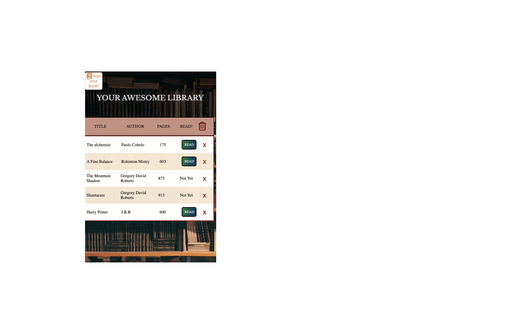

  
   

# 📖 [Library - BOOK LIST] 

**[Library - Book List]** is a small library app where you can record a list of books that you have read or you want to read. 

## Requierements ##

-Project from The Odin Projec's curriculum. 
   -Main Requierements:
  1. Write a function that loops through the array and displays each book on the page. 
  2. Add a “NEW BOOK” button that brings up a form allowing users to input the details for the new book: author, title, number of pages, whether it’s been read and anything else you might want.
  3. Add a button on each book’s display to remove the book from the library.
  4. Add a button on each book’s display to change its read status
*Note: Local storage was not requiered in this project but I implemented to practice and learn about it.

## 🛠 Built With 

### Tech Stack 

> Javascript
> CSS
>HTML

### Key Features 

- **Totally responsive for mobiles, tablets and desktops**
- **Modal to add book in the mobile version**
- **Add and remove book**
- **Data saved in  local Storage**

## 🚀 Live Demo 

> Here you can see the live demo of my project:

- [Live Demo Link](https://rivasbolinga.github.io/Library/)

👤 **Andrea Rivas Palacios**

- GitHub: [@rivasbolinga](https://github.com/rivasbolinga)
- Twitter: [@AndreaRivasPal](https://twitter.com/AndreaRivasPal)

## 🔭 Future Features 

> Cooming soon;

- [ ] **[Books saved in Icloud]**
- [ ] **[Next pages to save lots of books!!]**

